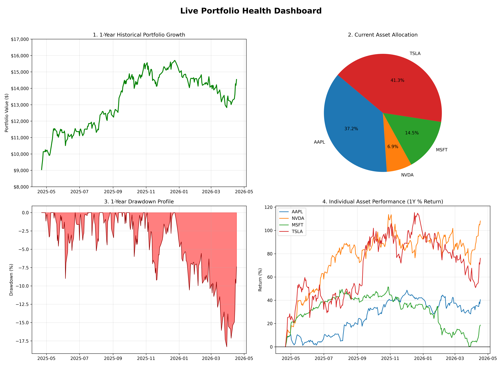
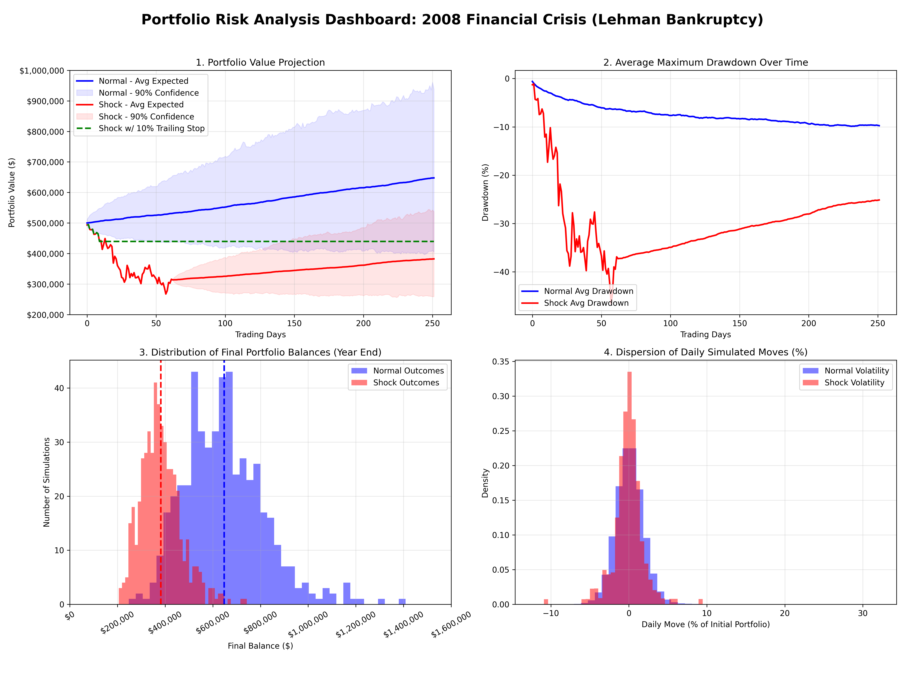

# Financial Risk & Portfolio Management Simulator

A dual-mode CLI application that acts as both a **Live Portfolio Diagnostics Tracker** and an advanced **Historical Black Swan Simulator**. 

This system allows traders and investors to track their real-time performance and mathematically stress-test how their current holdings would survive during massive economic tragedies, utilizing Monte Carlo Jump-Diffusion models and Modern Portfolio Theory.

## Features

### Mode 1: Live Portfolio Tracker & Diagnostics
- **Real-Time P&L Tracking:** Input your holdings (shares and average cost) to automatically fetch live market prices and calculate your exact Dollar and Percentage P&L.
- **Quantitative Performance Metrics:** Automatically calculates 1-Year Annualized Returns, Volatility, Sharpe Ratio, and Maximum Drawdown.
- **Health Dashboard:** Generates a 4-panel `portfolio_diagnostics.png` visualization containing historical growth paths, asset allocation pie charts, and normalized drawdown profiles.

### Mode 2: Historical Shock Simulator
- **Historical Black Swans:** Simulate against events like the 2008 Financial Crisis, COVID-19 pandemic crash, Dot-Com Bubble, and 9/11.
- **Modern Portfolio Theory (MPT) Optimization:** Instead of guessing weights, use our built-in engine to automatically allocate your assets for Maximum Sharpe Ratio or Minimum Volatility based on historical correlations.
- **Monte Carlo Generation:** Uses advanced correlated Geometric Brownian Motion with Jump-Diffusion mathematics to compute 500 potential future trajectories.
- **Risk Mitigation Analysis:** Automatically calculates actionable safety strategies, such as precise 10% trailing stop-losses.
- **Graphical Dashboard:** Automatically generates and saves a highly detailed `cli_shock_simulation.png` mathematical dashboard for deep visual analysis.

## Example Output & Results

### Mode 1: Live Portfolio Diagnostics
When running the real-time tracker, the application outputs a clean, institutional-grade summary of your holdings:
```text
====================================================
      LIVE PORTFOLIO TRACKER & DIAGNOSTICS      
====================================================
--- Real-Time Holdings & P&L ---
Ticker   | Shares     | Avg Cost   | Curr Price | P&L ($)      | P&L (%) 
-------------------------------------------------------------------------
AAPL     | 10.00      | $150.00    | $270.23    | $1202.30     |  80.15%
-------------------------------------------------------------------------
TOTAL    | -          | $1500.00   | $2702.30   | $1202.30     |  80.15%

--- 1-Year Performance Diagnostics ---
Annualized Return:       37.19%
Annualized Volatility:   23.56%
Sharpe Ratio:            1.49
Maximum Drawdown (1Y):   -13.80%
```



### Mode 2: Historical Shock Simulator
Simulating a massive historical crash like the 2008 Financial Crisis yields predictive performance and mitigation data:
```text
====================================================
         HISTORICAL SHOCK SIMULATOR                 
====================================================
--- Portfolio Value Prediction (1 Year Frame) ---
Normal Expected Return:      +$8,450.21 (+8.45%)
Shock Expected Return:       -$25,120.50 (-25.12%)

--- Risk Mitigation & Hedging ---
Trailing Stop-Loss (10%):    Saves ~$12,500 by exiting to cash
Put Option Hedge Strategy:   Costs ~$2,000 upfront for downside protection
```



## Setup & Installation

1. Create a virtual environment (optional but recommended):
```bash
python -m venv .venv
source .venv/bin/activate
```

2. Install the necessary quantitative libraries:
```bash
pip install yfinance pandas numpy matplotlib scipy
```

## How to Run

Launch the interactive CLI simulator:
```bash
python cli.py
```

Follow the on-screen prompts to select your mode, build your portfolio, and generate advanced analytics.
