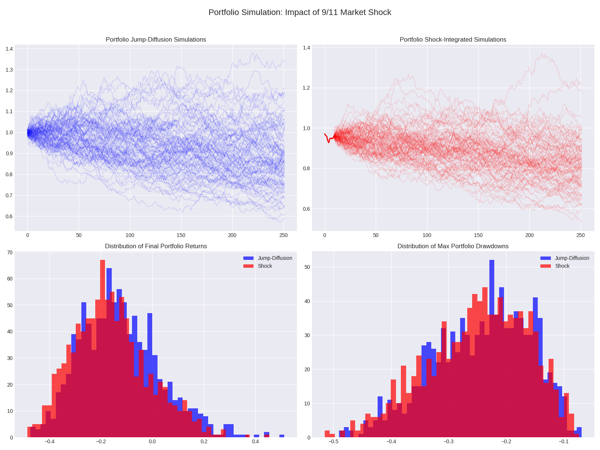

# Simulating the Market Impact of Financial Shocks

This project uses Monte Carlo methods to analyze the market impact of an unexpected, severe event: the September 11, 2001 attacks. It simulates and contrasts normal market behavior with scenarios that incorporate the shock, quantifying the effect on returns, volatility, and risk metrics.

The analysis evolves through three stages:
1.  **Simple Monte Carlo**: A basic simulation using Geometric Brownian Motion.
2.  **Jump-Diffusion Model**: A more realistic simulation using the Merton Jump-Diffusion model to account for sudden price jumps.
3.  **Portfolio Simulation**: An advanced simulation of a diversified portfolio to study correlation and diversification effects during a crisis.

---

## 1. Simple Monte Carlo Simulation (`sim.py`)

### Methodology
-   **Model**: Geometric Brownian Motion (GBM), which assumes continuous price movements.
-   **Data**: S&P 500 (`^GSPC`) daily data from 1995 to 2002.
-   **Scenarios**:
    1.  **Normal**: Simulates future paths based on the historical mean and volatility from the pre-shock period (before Sept 11, 2001).
    2.  **Shock**: Each simulation begins with the actual market returns from the week the market reopened (Sept 17-28, 2001) and then continues based on the pre-shock historical parameters.

### Key Findings
This initial model demonstrated that incorporating the shock led to significantly lower final returns and higher drawdowns compared to the "normal" simulations, confirming the severe negative impact of the event.

---

## 2. Merton Jump-Diffusion Model (`jump_diffusion_sim.py`)

### Methodology
To create a more realistic model of market behavior, the simulation was upgraded to a **Merton Jump-Diffusion model**. This model acknowledges that asset prices do not move continuously and can experience sudden, large jumps.

The model is described by the formula:
$$ \frac{dS_t}{S_t} = \mu dt + \sigma dW_t + dJ_t $$
Where:
-   $ \mu dt + \sigma dW_t $ is the standard Geometric Brownian Motion.
-   $ dJ_t $ is a compound Poisson process representing the random jumps.

### Key Findings
This model provides a more nuanced view of risk by explicitly modeling the probability and magnitude of extreme events. The results show a wider distribution of potential outcomes, highlighting the "fat tails" often observed in financial markets.

---

## 3. Multi-Asset Portfolio Simulation (`portfolio_sim.py`)

### Methodology
The final and most advanced model simulates a diversified portfolio to understand how asset correlations behave during a crisis.

-   **Portfolio Composition**: An equally-weighted portfolio (25% each) of:
    -   S&P 500 (`^GSPC`)
    -   NASDAQ (`^IXIC`)
    -   Gold (`GC=F`)
    -   10-Year Treasury Notes (`ZN=F`)
-   **Correlation**: The simulation uses the historical **covariance matrix** from the pre-shock period and a **Cholesky decomposition** to generate correlated random asset paths.
-   **Jumps**: Portfolio-level jumps are included, estimated from the historical returns of the combined portfolio.

### Simulation Results

The script was last run on March 9, 2026, yielding the following results:

#### Portfolio Risk and Return Analysis
| Metric             | Jump-Diffusion | Shock     |
|--------------------|----------------|-----------|
| **VaR (95%)**      | -35.19%        | -37.72%   |
| **CVaR (95%)**     | -39.32%        | -41.58%   |
| **Volatility**     | 15.56%         | 14.75%    |
| **Skewness**       | 56.33%         | 50.32%    |
| **Kurtosis**       | 42.40%         | 14.91%    |
| **Avg Final Return**| -12.43%        | -16.20%   |
| **Avg Max Drawdown**| -24.29%        | -24.94%   |

#### European Call Option Pricing (Post-Shock)
-   **Time to Maturity**: 90 days
-   **Strike Price**: 1.00 (At-the-money)
-   **Assumed Risk-Free Rate**: 2.00%
-   **Estimated Call Option Price**: **$0.0104**

### Visualization of Portfolio Simulation


---

## How to Run the Project

### 1. Environment Setup
It is recommended to use a `conda` environment to manage dependencies.

```bash
# Create and activate a new conda environment
conda create -n financial_shock_env python=3.10 -y
conda activate financial_shock_env

# Install necessary packages
pip install yfinance pandas numpy matplotlib scipy
```

### 2. Running the Simulations
You can run any of the three simulation scripts from the terminal:

```bash
# To run the simple GBM simulation
python sim.py

# To run the jump-diffusion simulation for a single asset
python jump_diffusion_sim.py

# To run the advanced multi-asset portfolio simulation
python portfolio_sim.py
```

The scripts will download the required data, run the simulations, print the results to the console, and save a visualization plot as a `.png` file in the project directory.